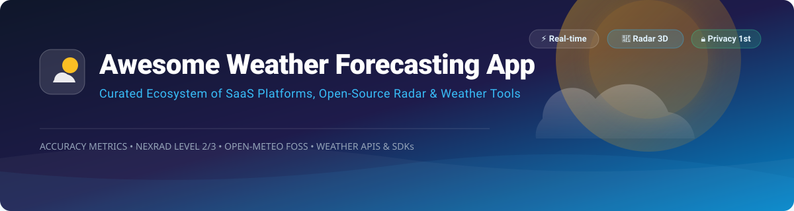

# 🌤️ Awesome-Weather-Forecasting-App

## ⚡ Curated Ecosystem of SaaS Weather Platforms & Open-Source Weather Projects

*A comprehensive developer & user guide focused on forecast accuracy, NEXRAD 3D radar visualization, real-time severe storm warnings, and privacy-first weather apps.* 🌧️🌩️☀️

**Last updated: October 2026** 📅

---

This repository tracks notable **SaaS weather platforms** ☁️, **weather APIs** 📡, and **open-source weather projects** 💻. Whether you are looking for current condition widgets, hourly and 16-day extended predictions, radar velocity imagery, NOAA severe weather alerts, or open data models (ECMWF, GFS, ICON, HRRR), this curated list provides the best tools available. 🌐

---

## 📋 Table of Contents

- [📊 Market Analysis & Overview](#-market-analysis--overview)
- [🏢 SaaS / Hosted Weather Platforms](#-saas--hosted-weather-platforms)
- [🔓 Open-Source GitHub Weather Projects](#-open-source-github-weather-projects)
- [🤝 How to Contribute](#-how-to-contribute)
- [⚠️ Disclaimer](#%EF%B8%8F-disclaimer)
- [❤️ Support & Sponsorship](#%EF%B8%8F-support--sponsorship)
- [🌟 Star History](#-star-history)

---

## 📊 Market Analysis & Overview

> **Market Size & Structure**: The global weather forecasting services market is valued at approximately **$2.5 Billion – $3.2 Billion USD** and is projected to reach **$4.5+ Billion USD by 2030**. The consumer and commercial SaaS weather sector is **moderately fragmented**. High-capital operations (global weather model infrastructure, satellite feeds, proprietary minute-by-minute nowcasting like AccuWeather MinuteCast or Watson AI) are concentrated among a few major enterprise leaders (AccuWeather, The Weather Channel/IBM, Yahoo). However, specialized consumer apps, mobile-first design products (Windy, Carrot, RadarOmega), and a vibrant open-source ecosystem (Open-Meteo, Breezy Weather, wttr.in) capture significant niche user bases. 📈

---

## 🏢 SaaS / Hosted Weather Platforms

Below is a comparison of top commercial weather platforms and API services, sorted by **Company Size / Estimated Annual Revenue (Descending)**: 💸

| Platform | Estimated Revenue / Valuation 💰 | Starting Pricing Tier 🏷️ | Free Tier / Free Trial Limits 🎁 | Key Features & Focus 🌟 |
| :--- | :--- | :--- | :--- | :--- |
| **[AccuWeather](https://www.accuweather.com/)** | **~$150M – $500M** | **$2/month** (Starter API plan: 15,000 calls/mo) | **14-Day Free Trial** (500 Core API calls/day or 50 MinuteCast calls/day) | Proprietary MinuteCast™ minute-by-minute precipitation predictions, global severe alerts, commercial weather API. |
| **[The Weather Channel](https://weather.com/)** | **~$200M – $350M** (Allen Media Group) | **$2.50/month** ($29.99/year Premium app) / **$4.99/month** (Live TV stream) | **Free Web & App Tier** (Ad-supported with basic hourly & 10-day forecasts) | IBM Watson AI integration, extensive broadcast radar, severe weather emergency broadcasts. |
| **[Yahoo Weather](https://www.yahoo.com/news/weather/)** | **Part of Yahoo Ecosystem** (~$5B+ parent group) | **Free** (Ad-supported portal & mobile app) | **Unlimited Free Access** (Ad-supported consumer web portal and iOS/Android app) | Clean minimalist interface, Flickr photo integration based on location weather, basic radar & daily forecasts. |
| **[Windy.com](https://www.windy.com/)** | **~$3.5M – $7.2M** | **$18.99 – $34.99/year** (Windy Premium) | **Unlimited Free Tier** (Access to GFS, ECMWF, ICON maps with 3-hour forecast steps & standard updates) | Interactive animated wind/wave/radar map visualizations, popular with sailors, pilots, storm chasers, and outdoor enthusiasts. |
| **[Carrot Weather](https://www.meetcarrot.com/weather/)** | **~$1.8M – $2.4M** | **$4.99/month** ($19.99/year Premium Tier) | **7-Day Free Trial** for Premium features (App is paid/freemium with basic features locked) | Humorous AI personality, multi-source weather data selection (Apple Weather, AccuWeather, AerisWeather), ultra-customizable widgets. |
| **[RadarOmega](https://www.radaromega.com/)** | **Niche SaaS** (~$1M–$2M estimated) | **$8.99 one-time** base purchase + **$4.99/month** (Gamma tier) | **No Permanent Free Tier** (Base app requires $8.99 upfront purchase; subscriptions add multi-platform & high-res radar) | Professional-grade NEXRAD Level 2/3 radar display, 3D volumetric sweeps, custom storm tracking, desktop cross-platform support. |
| **[Overdrop](https://overdrop.app/)** | **Indie App** (<$1M estimated) | **~$1.00/month** (In-app Premium unlock) | **Unlimited Free Tier** (Ad-supported access to basic weather forecasts and select home screen widgets) | Aesthetic Android weather app focused on home-screen widgets, custom themes, multiple weather data providers. |
| **[Weather Underground](https://www.wunderground.com/)** | **Subsidiary of TWC/IBM** | **$3.99/month** ($19.99/year Ad-free) | **Unlimited Free Tier** (Ad-supported web & mobile access to Personal Weather Station data) | Hyperlocal weather reporting backed by a massive network of 250,000+ personal weather stations (PWS). |

---

## 🔓 Open-Source GitHub Weather Projects

Below are top open-source weather apps, radar engines, terminal weather clients, and frameworks, sorted by **GitHub Star Count (Descending)**: 🚀

| Project & Repository | Stars ⭐ | Description & Stack 🛠️ | License 📜 |
| :--- | :--- | :--- | :--- |
| **[wttr.in](https://github.com/chubin/wttr.in)** |  | Console-oriented weather forecast service supporting ANSI terminal output, HTML, PNG rendering, cURL support, and zero configuration. | Apache-2.0 |
| **[Breezy Weather](https://github.com/breezy-weather/breezy-weather)** |  | Feature-rich Android weather app supporting 50+ weather sources (Open-Meteo, AccuWeather, etc.), Material 3 Expressive UI, home screen widgets, and zero personal data collection. | LGPL-3.0 |
| **[Open-Meteo](https://github.com/open-meteo/open-meteo)** |  | Open-source weather API providing FOSS weather forecasts, historical climate data, ensemble models, and marine/air-quality APIs using open national weather service data (DWD, NOAA, ECMWF). | GPL-3.0 |
| **[Supercell Wx](https://github.com/rcg4u/supercell-wx)** |  | Native cross-platform (Windows, Linux, macOS) C++/Qt weather radar viewer for NEXRAD Level 2 and 3 data with severe weather alerts and responsive maps. | MIT |
| **[OpenStorm](https://github.com/JordanSchlick/OpenStorm)** |  | 3D weather radar viewer built with Unreal Engine 5 using custom volumetric ray marching shaders for 3D NEXRAD reflectivity, velocity, and VR support. | MIT |
| **[Mousam](https://github.com/amitmerchant1990/mousam)** |  | Clean, minimal, and fast cross-platform desktop/mobile weather client powered by Open-Meteo API. | MPL-2.0 |
| **[Hookecho](https://github.com/d4vid87/hookecho)** |  | Advanced NEXRAD radar viewer in Rust with Level 2/3 GPU polar rendering pipeline, storm-relative velocity, GRLevelX color tables, and warning verification. | MIT |
| **[OSS Weather](https://github.com/ossappscollective/oss-weather)** |  | Lightweight, privacy-first Android weather application with zero ads, no tracking, interactive radar maps, and multiple API providers. | MIT |
| **[FluentWeather](https://github.com/derfloh205/FluentWeather)** |  | Modern Windows UWP weather application featuring Fluent Design system, desktop widgets, multi-location tracking, and background synchronization. | MIT |
| **[Bura](https://github.com/Webini/bura)** |  | Android application that transforms and visualizes Open-Meteo atmospheric forecasts into high-resolution charts and trend metrics. | GPL-3.0 |
| **[Raindrop](https://github.com/binarydoubling/raindrop)** |  | Feature-rich terminal weather dashboard in Python 3.12 with sparkline graphs, technical meteorological analysis (EMA crossovers), and astronomical data. | MIT |

### 📌 Additional Notable Open-Source Projects

- **[Geometric Weather](https://github.com/Chaocipher/GeometricWeather)** — High-performance Android weather app with real-time temperature, air quality, and 15-day forecasts. *(Archived)* ❄️
- **[WeatherMaster](https://github.com/SubhamTyagi/WeatherMaster)** — Android weather application inspired by Pixel Weather design language. 📱
- **[WeatherBench 2](https://github.com/google-research/weatherbench2)** — Benchmark evaluation framework by Google Research for data-driven weather forecasting AI/ML models. 🧪

---

## 🤝 How to Contribute

1. Fork the repository. 🍴
2. Add or edit entries in `README.md` maintaining table formatting. 📝
3. Ensure entries include accurate pricing, repository URLs, star badges, and factual descriptions. 🎯
4. Submit a Pull Request with a short summary of changes. 🔀

---

## ⚠️ Disclaimer

- This is a **community-curated list** for informational and developer reference. ℹ️
- Weather applications handle location data; always review individual privacy policies prior to deployment or use. 🔒
- **Severe weather warnings are life-safety critical**. Never rely solely on community apps for emergency weather situations; maintain active NOAA Weather Radio feeds or official government alerts. 🚨

---

## ❤️ Support & Sponsorship

Thank you for exploring this curated weather forecasting ecosystem! If you find this resource useful for your projects, research, or daily weather tracking, please consider supporting the project:

- 🌟 **Star this repository** to help others discover it!
- 🔀 **Fork & Share** with fellow weather enthusiasts and developers.
- ☕ **Buy me a coffee / Sponsor**: If you'd like to support ongoing maintenance and curated developer lists, feel free to sponsor via [GitHub Sponsors](https://github.com/sponsors/ishandutta2007).

Your support is immensely appreciated! 🙏

---

## 🌟 Star History

---

**Made with ❤️ for weather enthusiasts, storm chasers, software developers, and privacy-conscious users.** 🌈
